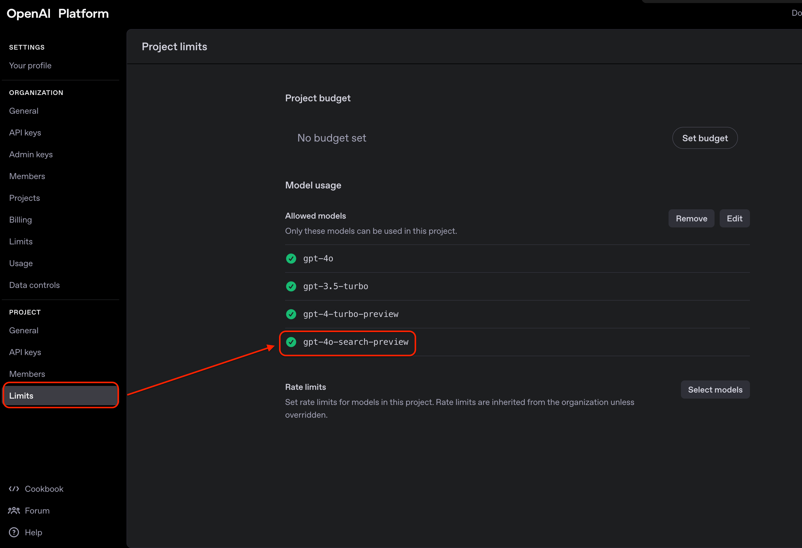

# OpenAI Search Tool

使用 OpenAI GPT-4 搭配網路搜尋功能的命令行工具。

## 功能特色

- 🔍 整合網路搜尋功能的 AI 對話
- 🌍 支援台灣地區的本地化搜尋
- ⚙️ 可配置的模型和搜尋選項
- 📱 命令行友好介面

## 安裝

1. 克隆此專案：
```bash
git clone <your-repo-url>
cd gpt-python
```

2. 建立虛擬環境：
```bash
python -m venv .
source bin/activate  # macOS/Linux
# 或 bin\activate.bat  # Windows
```

3. 安裝依賴：
```bash
pip install openai
```

## 設定

在 `openai_search.py` 中更新你的 OpenAI API Key：

```python
CONFIG = {
    "api_key": "your-openai-api-key-here"
}
```

> ⚠️ **安全提醒**：不要將 API Key 提交到版本控制系統中！

## 使用方法

### 命令行使用

基本用法：
```bash
python openai_search.py -q "你的問題"
```

指定模型：
```bash
python openai_search.py -q "搜尋台灣美食推薦" -m "gpt-4o"
```

查看幫助：
```bash
python openai_search.py -h
```

### 程式碼中使用

```python
from openai_search import chat_with_search

# 使用預設配置
result = chat_with_search("搜尋最新科技新聞")

# 使用自訂配置
custom_config = {
    "model": "gpt-4o-search-preview",
    "api_key": "your-key",
    "web_search_options": {...}
}
result = chat_with_search("你的問題", custom_config)
```

## 配置選項

可以在 `CONFIG` 中調整以下設定 ([Ref](https://platform.openai.com/docs/guides/tools-web-search?api-mode=chat))：

- `model`: 使用的 GPT 模型，建議使用 `gpt-4o-search-preview` 或 `gpt-4o-mini-search-preview`
- `web_search_options`: 搜尋參數配置
  - `search_context_size`: 搜尋上下文大小 (`low`, `medium`, `high`)
  - `user_location`: 使用者位置設定（影響搜尋結果）
- 請同步確認 OpenAI Platform 的後台是不是有開啟對應的 model 
## 範例

```bash
# 搜尋新聞
python openai_search.py -q "搜尋這週台灣科技新聞"

# 尋找資訊
python openai_search.py -q "台北最好吃的牛肉麵店"

# 即時資料查詢
python openai_search.py -q "今天台股大盤走勢"
```

## 注意事項

- 需要有效的 OpenAI API Key
- 使用搜尋功能會消耗較多 API 配額
- 搜尋結果會受到地區設定影響

## 授權

MIT License
